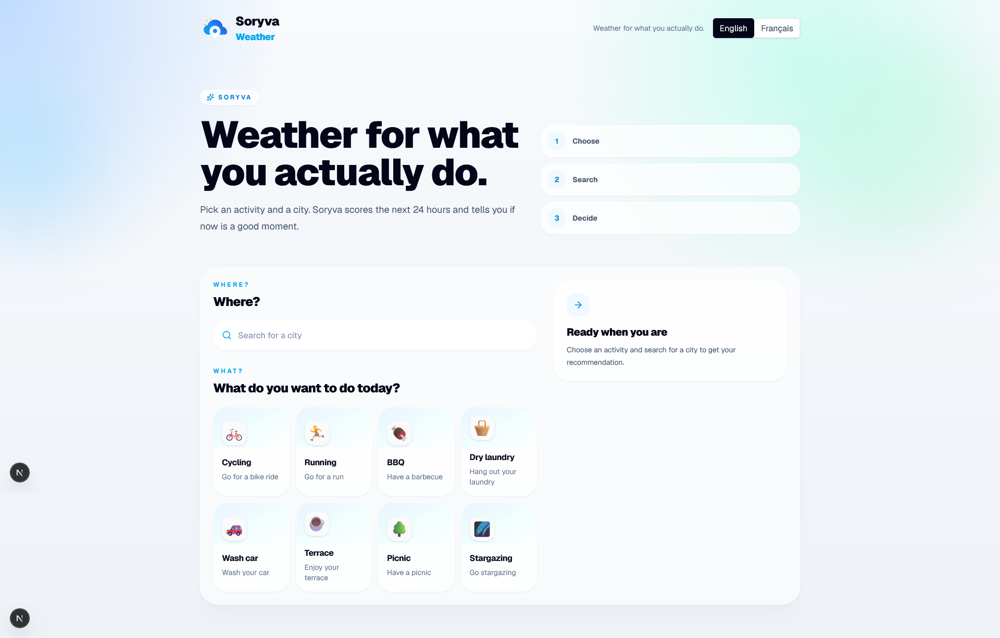

<div align="center">
  

  # Soryva Weather

  **Weather for what you actually do.**

  A decision-first weather app that helps you know whether now is the right moment for an activity.
</div>

## Preview

> The app is available in French and English.

| Français | English |
| --- | --- |
|  |  |

## Features

- Activity-based weather recommendations
- City search powered by Open-Meteo geocoding
- 24-hour weather scoring
- Best time window detection
- Clear recommendation statuses: Go, Maybe, No
- Explanation for each recommendation
- Hourly timeline
- Shareable recommendation text
- French and English interface
- Responsive polished UI
- No account, database, paid API key, or server secret required

## Activities

Soryva currently supports:

- Cycling
- Running
- BBQ
- Dry laundry
- Wash car
- Terrace
- Picnic
- Stargazing

Each activity has its own weather rules for temperature, rain, wind, humidity, clouds, UV, and general conditions.

## Tech stack

- Next.js App Router
- React
- TypeScript
- Tailwind CSS
- next-intl
- Lucide React
- Open-Meteo Forecast API
- Open-Meteo Geocoding API

## Getting started

Install dependencies:

```bash
npm install
```

Run the development server:

```bash
npm run dev
```

Open the app:

```text
http://localhost:3000
```

Build for production:

```bash
npm run build
```

Run lint:

```bash
npm run lint
```

Start the production server:

```bash
npm run start
```

## Internationalization

The app supports two locales:

- English: `/en`
- French: `/fr`

Translations are stored in:

```text
messages/en.json
messages/fr.json
```

Localized routes are handled through the Next.js App Router:

```text
app/[locale]/
```

## How scoring works

Activities are defined in:

```text
data/activities.ts
```

The scoring engine evaluates each forecast hour from 0 to 100 using activity-specific rules:

- temperature comfort
- rain probability
- precipitation
- wind speed and gusts
- humidity
- weather condition
- optional cloud cover and UV preferences

Scores are converted into simple statuses:

| Score | Status |
| --- | --- |
| 70-100 | Go |
| 40-69 | Maybe |
| 0-39 | No |

The best time window is calculated by comparing the next 24 hours and selecting the strongest 1-hour or 2-hour window.

## Project structure

```text
app/
  [locale]/
  globals.css
  layout.tsx
  icon.svg
components/
  app/
  ActivityCard.tsx
  ActivitySelector.tsx
  CitySearch.tsx
  Header.tsx
  HourlyTimeline.tsx
  RecommendationCard.tsx
  ScoreBadge.tsx
  ScoreReasons.tsx
  ShareButton.tsx
  WeatherStats.tsx
data/
  activities.ts
i18n/
  request.ts
lib/
  bestTime.ts
  format.ts
  geocoding.ts
  i18n.ts
  openMeteo.ts
  scoring.ts
  share.ts
  weatherCodes.ts
messages/
  en.json
  fr.json
public/
  soryva-logo.svg
```

## Environment

No API key is required. Soryva uses the public Open-Meteo APIs.

You can copy the example environment file if needed:

```bash
cp .env.example .env.local
```

## License

This project is licensed under the MIT License.
